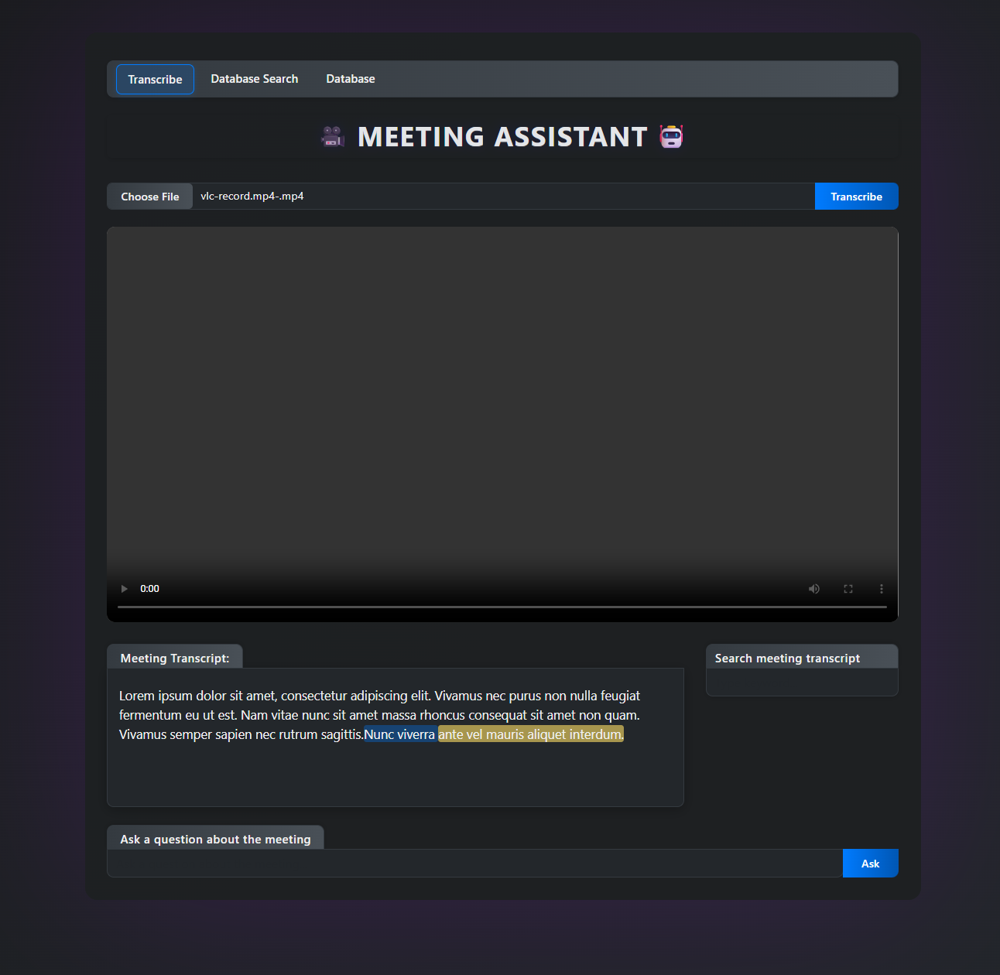
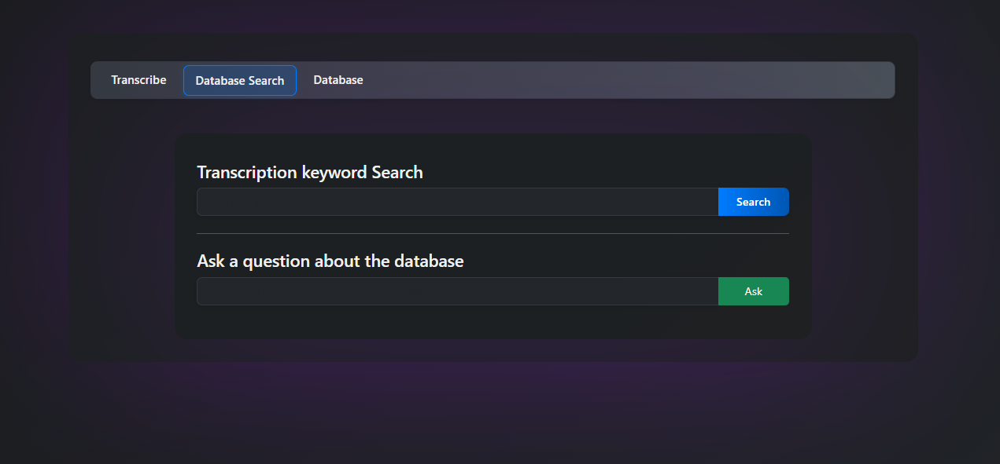
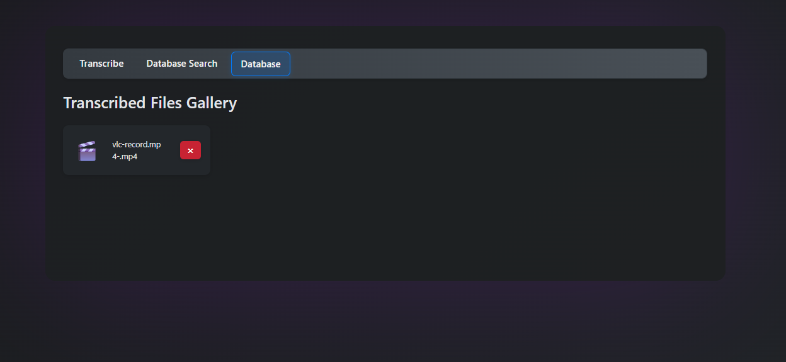

# 🤖 Meeting Assistant

🌐 **Try the app live:** [https://meetingassistant-app.azurewebsites.net/](https://meetingassistant-app.azurewebsites.net/)

A modern, user-friendly web app for instantly transcribing your meetings, lectures, interviews, or any video/audio content—using Azure OpenAI Whisper and GPT. Effortlessly search, jump to moments, and ask questions about your content to save time and boost productivity! 🚀

Authors: Miłosz Skibiński [miloSK1] & Aleksy Bukowski [AleksyBukowski]

🔍 Prompting: <br>
Having a specific solution in mind and then prompting Copilot to implement it was probably the most efficient method, resulting in very few errors. On the other hand, leaving the creative part to Copilot and attempting to implement too many large, comprehensive solutions at once led to more problems. A better approach was to ask Copilot about possible solutions and then break them down into smaller parts.

✅ Validation & Feedback:

The more detailed the prompt, the less feedback was needed. However, solving small parts of a problem and then guiding Copilot after each step proved to be a very effective way of working. Validation was mostly done by checking whether the implemented solutions worked in action, asking Copilot to explain the logic behind them, and performing tests.

🔁 Rework & Iteration:

Tasks further removed from pure coding required the most rework - such as Azure integration, getting the Dockerfile to work, and managing communication between different architectural components. Providing thorough context always helped: including all variables, explaining what had already been done and achieved. The more precise the terminology, the better Copilot performed.

🧪 Code Quality:

The code quality was generally good, although syntax errors occasionally occurred. As the project grew, integrating everything became more challenging. Still, with sufficient context, Copilot was able to resolve most issues efficiently.

🤖 Agent Behavior & Autonomy:

Copilot's behavior was quite predictable when given detailed instructions and allowed to handle implementation. However, when stuck on a complex problem, it sometimes looped - repeating the same commands - or chose unnecessarily complicated solutions. Once the overall direction was clarified and it was guided toward a simpler path, it usually handled the problem well.

🧭 Overriding the Agent:

Due to the time it took for Copilot to grasp the full project context, making very small changes - like adjusting some little frontend padding - was often easier to do manually. It also struggled with file paths, frequently referencing files that were actually located in different folders.

🧠 Cognitive Load & Flow:

Copilot’s ability to handle implementation details significantly reduced the time required to complete tasks. It also lowered the cognitive load needed for the less necessary details, allowing us to focus more on the creative aspects and rapidly move from idea to finished project.

👀 Final Observations:

Copilot’s ability to connect the dots and understand context with such precision was genuinely impressive - it really felt like working with an experienced colleague. While it had its flaws, such as introducing more new bugs while fixing others if the problem was too complex or struggling with paths, the better our prompts and understanding of the problem, the better the agent's implementation. Although I wouldn’t fully trust its output without supervision, the time and mental effort it saved us during implementation were immense.
---

## 📚 Table of Contents
- [Overview](#overview)
- [Demo](#demo)
- [Features](#features)
- [Tech Stack](#tech-stack)
- [Architecture](#architecture)
- [Setup & Installation](#setup--installation)
- [Usage](#usage)
- [Testing](#testing)
- [Contributing](#contributing)
- [License](#license)

---

## 📝 Overview
Meeting Assistant lets you upload any meeting, lecture, interview, or other video/audio file and get a fast, accurate transcription. Instantly search through the transcript, jump to specific moments, find keywords, and even ask AI-powered questions about your content. Save hours of manual review and get straight to what matters! ✨

## 🖼️ Demo

Below are some screenshots showcasing the Meeting Assistant in action:







## ✨ Features
- Upload and transcribe meetings, lectures, interviews, and more in various formats (mp4, mkv, avi, wav, mp3, etc.)
- **Duplicate detection:** Uploading or transcribing a duplicate file fetches the existing transcript from the database—no wasted compute!
- **Database tab:** View, transcribe, and delete files. No manual add—files are added via the Transcribe tab only.
- **Database Search tab:** Search and ask questions across all transcriptions using GPT.
- All transcriptions are stored in a persistent database (SQLite via Flask-SQLAlchemy).
- Uploaded files are stored in a persistent `uploads` folder. Deleting a file from the database tab also deletes the file from disk.
- Automatic audio extraction and conversion for unsupported file types.
- Accurate transcription using Azure OpenAI Whisper.
- Search through the transcript and jump to video moments 🔍
- Keyword highlighting and instant navigation
- Ask prompts about the video using GPT 🤖
- Download or copy transcribed text
- Responsive UI with React Bootstrap
- **Q&A:** Ask questions about a single meeting or across your entire database and get instant, AI-powered answers.
- **Global Search:** Find keywords, topics, or speakers across all your meetings.
- **Seamless UX:** Switch between tabs, preview videos, and manage files with ease.
- **Robust file management:** Prevent duplicates, auto-transcribe on upload, and keep your workspace organized.

## 🛠️ Tech Stack
- **Frontend:** React, React Bootstrap
- **Backend:** Python Flask
- **Transcription:** Azure OpenAI Whisper
- **Other:** ffmpeg (for audio extraction)
- **Database:** SQLite (via Flask-SQLAlchemy)
- **AI Q&A:** Azure OpenAI GPT

## 🏗️ Architecture
```
[User] ⇄ [React Frontend] ⇄ [Flask Backend] ⇄ [Azure OpenAI Whisper & GPT]
```
- The frontend handles file uploads, search, and AI queries.
- The backend processes files, interacts with Azure, and returns transcriptions and GPT responses.
- All files and transcriptions are managed in a persistent database and uploads folder.

## ⚡ Setup & Installation
### Prerequisites
- Node.js (v18+ recommended)
- Python 3.10+
- ffmpeg
- Azure account with OpenAI Whisper and GPT deployments

### 1. Clone the Repository
```bash
git clone https://github.com/Vibe-coding-on-Agentic-DevOps/vibe-coding-poz-wro.git
cd vibe-coding-poz-wro
```

### 2. Configure Environment Variables
- Copy `workspace/backend/.env.example` to `workspace/backend/.env` (or ensure `.env` exists).
- Fill in your Azure Whisper and GPT API endpoints and keys:
  - `AZURE_OPENAI_ENDPOINT` (Whisper)
  - `AZURE_OPENAI_KEY` (Whisper)
  - `AZURE_GPT_ENDPOINT` (GPT)
  - `AZURE_GPT_KEY` (GPT)

### 3. Quick Setup (Recommended)
Run the setup script to install all dependencies:
```bash
./workspace/setup-dev.sh
```

### 4. Running the App
Start both backend and frontend with one command:
```bash
./workspace/run-app.sh
```

#### Manual Start (Optional)
- **Backend:**
  ```bash
  cd workspace/backend
  python app.py
  ```
- **Frontend:**
  ```bash
  cd workspace/frontend
  npm start
  ```

## 🚀 Usage
1. Open the frontend in your browser (usually at http://localhost:3000).
2. Upload a meeting or video file via the Transcribe tab. (All files are managed in the Database tab after upload.)
3. Instantly search, jump to moments, highlight keywords, and ask questions about your meeting or the entire database!
4. Delete files from the Database tab to remove both the database entry and the file from disk.
5. Use the Database Search tab to find topics, speakers, or answers across all your meetings.

## 🧪 Testing

### Backend (Python/Flask)
- Tests are located in `workspace/backend/tests/`.
- To run backend tests:
  ```bash
  cd workspace/backend
  pytest
  ```
- Tests use a temporary database and do not affect your production data.
- Tests cover API endpoints for file upload, deletion, transcription, search, and Q&A.

### Continuous Integration (CI)
- Backend tests are automatically run on every push and pull request to the `main` branch using GitHub Actions.
- See `.github/workflows/python-tests.yml` for the workflow configuration.

## 🤝 Contributing
Contributions are welcome! Please open issues or submit pull requests for improvements, bug fixes, or new features. For major changes, please open an issue first to discuss what you would like to change.

## 🪪 License
This project is licensed under the MIT License.
